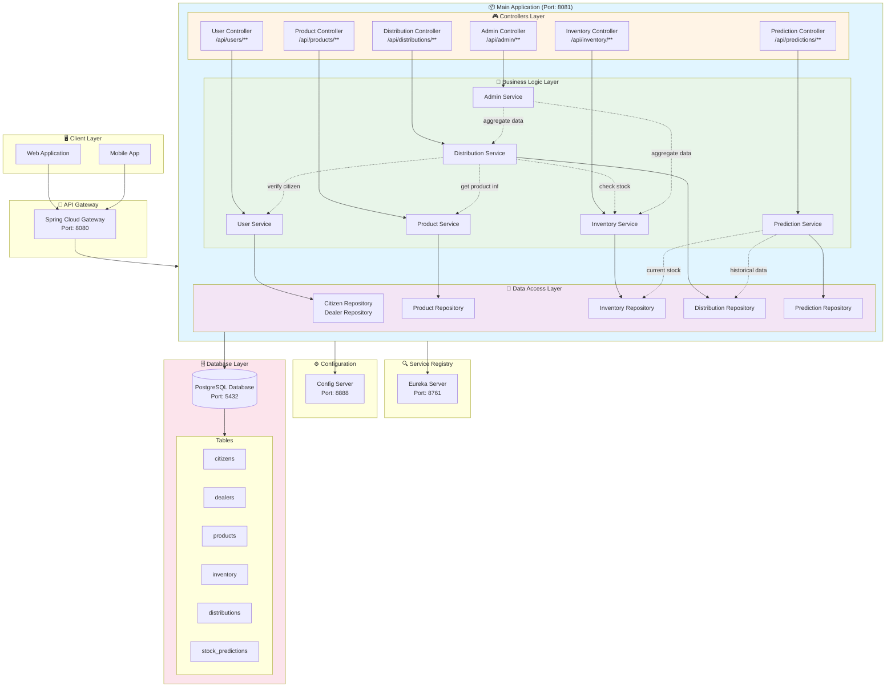
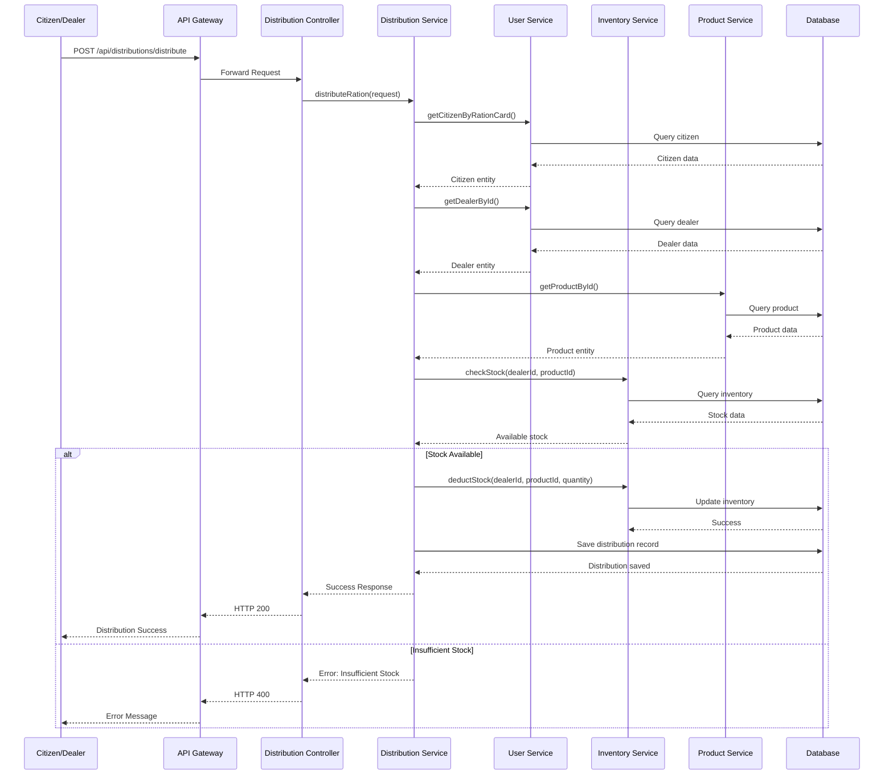
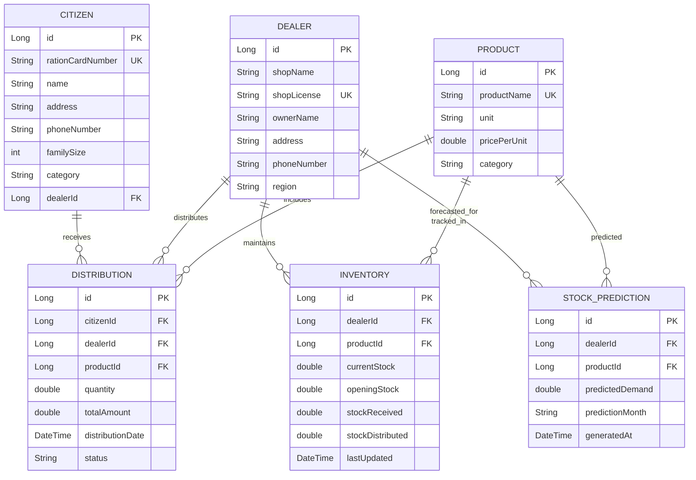

# 🏗️ E-Ration System - Complete Architecture Flow

---

## 🔄 Typical Flow: Citizen Distribution Request

---

## 📊 Data Model Relationships

---

## 🎯 Key Features Flow

### 1️⃣ User Management Flow
- **Register Citizen** → Validate → Save to DB → Link to Dealer
- **Register Dealer** → Validate Shop License → Save to DB
- **Get All Citizens** → Query DB → Return List
- **Get Citizen by Ration Card** → Search → Return Profile

### 2️⃣ Product Management Flow
- **Add Product** → Validate → Save to Catalog
- **Update Product** → Verify Existence → Update Price/Details
- **Get All Products** → Query Catalog → Return List

### 3️⃣ Inventory Management Flow
- **Add Stock** → Dealer + Product → Update Inventory
- **Check Stock** → Query Current Stock → Return Availability
- **Get Stock by Dealer** → Fetch All Products for Dealer
- **Deduct Stock** → Validate → Update Stock → Track Distribution

### 4️⃣ Distribution Flow
- **Distribute Ration**:
  1. Verify Citizen (ration card)
  2. Verify Dealer
  3. Check Product availability
  4. Check Inventory stock
  5. Calculate entitlement (based on category)
  6. Deduct stock
  7. Record transaction
  8. Return receipt

### 5️⃣ Admin & Reporting Flow
- **Get All Distributions** → Query DB → Aggregate
- **Dealer Performance Report** → Calculate metrics
- **Product Usage Report** → Aggregate by product
- **Low Stock Alert** → Check thresholds → Notify

### 6️⃣ Prediction Flow
- **Generate Prediction**:
  1. Fetch historical distribution data
  2. Fetch current stock levels
  3. Apply forecasting algorithm (simple average/trend)
  4. Save predictions
  5. Return forecast

---

## 🔐 Role-Based Access (For Future Security)

| Endpoint | Citizen | Dealer | Admin |
|----------|---------|--------|-------|
| POST /api/users/citizens | ❌ | ❌ | ✅ |
| GET /api/users/citizens/:id | ✅ (own) | ❌ | ✅ |
| POST /api/distributions/distribute | ❌ | ✅ | ✅ |
| GET /api/inventory/* | ❌ | ✅ (own) | ✅ |
| GET /api/admin/* | ❌ | ❌ | ✅ |
| POST /api/predictions/generate | ❌ | ❌ | ✅ |

---

## 🚀 Technology Stack

- **Backend**: Spring Boot 3.5.5
- **Database**: PostgreSQL
- **ORM**: Spring Data JPA
- **Service Discovery**: Eureka
- **API Gateway**: Spring Cloud Gateway
- **Config Management**: Spring Cloud Config
- **Validation**: Spring Boot Validation
- **Build Tool**: Maven

---

✅ **This architecture ensures**:
- Modular design (all functionality in one app but organized)
- Clear separation of concerns (Controller → Service → Repository)
- Scalable structure (easy to split into microservices later)
- Inter-service communication patterns ready
- Data integrity and validation at every layer
